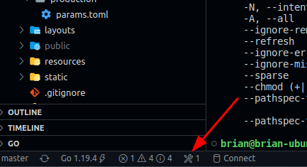

# Test Website

Welcome to our test website!

This site is assembled very similarly to how our real websites are built. One of our sites, for example, is <https://my.allaboutchallengecoins.com/login/>.

This website is put together with a couple of tools to help make writing and maintaining it easier, including:

- [Hugo](https://gohugo.io/) - The framework we use to help us organize our page content and HTML, and enables us to live-edit our websites while we write them.
- [Bootstrap 5.1](https://getbootstrap.com/docs/5.1/getting-started/introduction/) - SCSS framework for styling everything about our websites, making responsive website building easy, and making the look across our website consistent.
- [TypeScript](https://www.typescriptlang.org/) - The language used to write all client side functionality. No react or angular here, just plain old TypeScript. This example repo adds shortcuts to VS Code to help us compile our TypeScript.

These three tools all have very thorough and easy to use documentation, and it's the core of how we build all of our sites.

This project contains only client-side (front end) code. It is the goal of this client side code to make it as easy as possible for our customers to interact with our system. Customers come to our websites to request quotes for their custom products, add their quotes to their cart, order their carts, see order history, and more. We'd like to expand this functionality to include group pay, custom product builders, and all sorts of fun stuff.

You don't have to worry about setting up the project like this one initially, but you will be responsible for adding features and updating the files in this project.

## The test

This front end code will interact with our own, internally written, REST API, which is responsible for taking the customer inputs you give us and processing that data.

In this project, there is a contact page started that needs some blanks filled in.

- [content/contact.html](content/contact.html) has a form element but no fields.
    - Use <https://getbootstrap.com/docs/5.1/forms/layout/> to add the relevant contact form fields to the form. This should include a first name, last name, organization name, email address, and phone number.
- [assets/ts/pages/contact.ts](assets/ts/pages/contact.ts) has a call to our API using [axios](https://www.npmjs.com/package/axios), but it isn't finished yet. The call should POST all the fields you added in the previous step to our API.
    - Our API has its own documentation that you can find [here](https://api2.allaboutchallengecoins.com/docs/#/Contact%20Form%20Submissions/post_contacts).

Once the call succeeds, the client should redirect the user to a "Contact Success" page, which doesn't exist yet. It should be created as [content/contact-success.html](content/contact-success.html) and should say something like:

> Thank you for your request! We will reach out within 24 hours!

## VS Code

We use VS Code shortcuts to help build and test our websites. The two things you need to know for this test are:

1. Press Ctrl+Shift+B to bring up the build menu, and select and run the entry titled "Compile TS" to compile the TypeScript. You will see the compiling status of your code in the VS Code Terminal, and if it succeeds, the Hugo Test site will refresh with your updated, compiled code.
2. Press Ctrl+Shift+B to bring up the build menu, and select and run the entry titled "Hugo Server: Test Site". Once this is running, you should be able to navigate in your browser to <http://test.localhost:10506/contact/> to see your cool new contact form.

You can view your current running tasks in VS Code by clicking this icon at the bottom:

If you are familiar with GitHub, creating a fork of this repository with your changes would be fantastic.

---

Bonus! The website's styles are written in SCSS, which resides in the file [assets/scss/app.scss](assets/scss/app.scss). Edit this file to make this website whatever color you want!

---

If you have any questions *at all*, just ask them!